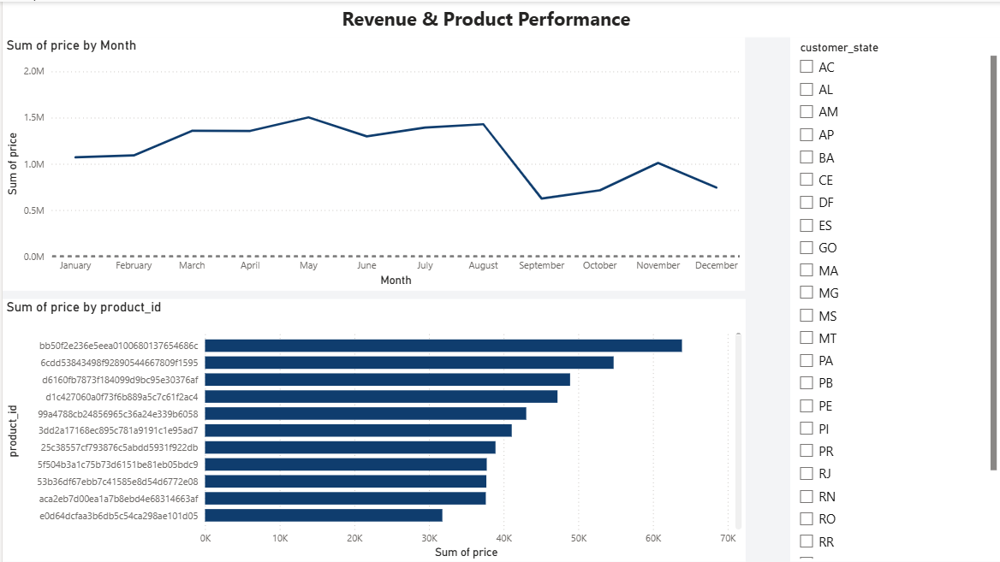

# End-to-End E-Commerce Performance & Operations Dashboard

## 📌 Project Overview
An interactive, multi-page Power BI dashboard built using an e-commerce dataset to analyze business revenue, supply chain freight costs, and operational order fulfillment. This project transforms raw transactional data into actionable business intelligence insights.

---

## 📊 Dashboard Pages & Features

### Page 1: Revenue & Product Performance
* **Visuals:** Monthly revenue line chart, top-performing products bar chart, and an interactive state slicer.
* **Business Insights:** Tracks seasonal sales fluctuations and identifies high-revenue product lines to optimize inventory management.
* 

### Page 2: Shipping & Freight Analysis
* **Visuals:** Total freight cost KPI summary card (2.25M), shipping timeline bar chart, and seller freight breakdown column chart.
* **Business Insights:** Audits supply chain overhead by tracking shipping expenses against delivery timelines and individual vendor performance.
* 

### Page 3: Order Fulfillment Overview
* **Visuals:** Total order volume KPI card (99,441), order status distribution donut chart, and categorical status bar chart.
* **Business Insights:** Measures operational health and fulfillment success rates, monitoring completed orders versus cancellations and processing exceptions.
* 

---

## 🛠️ Tools & Technologies Used
* **Power BI Desktop:** Data modeling, relationships, and layout design.
* **DAX (Data Analysis Expressions):** Used for aggregations and metrics (Sum of Price, Count of Orders, Sum of Freight Value).
* **GitHub:** Version control and portfolio documentation.

---

## 🚀 How to Explore This Project
1. Download the [.pbix file](./Ecommerce_Dashboard.pbix) from this repository.
2. Open the file using **Power BI Desktop** to interact with the data model, filters, and visuals locally.
